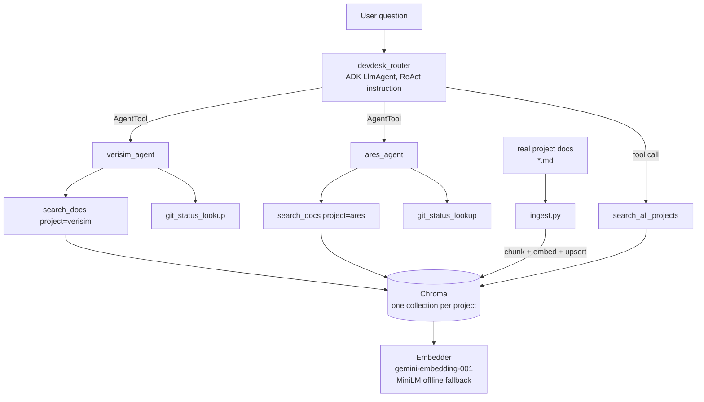

# DevDesk

A multi-agent RAG assistant built with [Google's Agent Development Kit
(ADK)](https://google.github.io/adk-docs/): a router agent delegates
questions to per-project specialist agents, each grounded in that
project's real documentation through retrieval-augmented generation.

It's built as a demonstration of the pattern an FDE (Applied AI) rebuilds
for every new customer — point the agent at a codebase/doc set (a
"tenant"), and it becomes a support agent for that project. The two
tenants used to build and evaluate it here are the author's own public
projects:

| Tenant | What it is | Source |
|---|---|---|
| `ares` | Local, Ollama-backed multi-agent stack | [Emperor-Z/ares](https://github.com/Emperor-Z/ares) (public, MIT) |
| `verisim` | Simulation-training dissertation project | [Emperor-Z/verisim](https://github.com/Emperor-Z/verisim) (public, MIT) |

New tenants are added by pointing `PROJECTS` in `src/devdesk/config.py` at
a source path and re-running `python -m devdesk.rag.ingest` — nothing else
in the router or the RAG pipeline is tenant-specific.

## Architecture



**Delegation pattern**: explicit tool-based delegation, not ADK's automatic
sub-agent transfer. The router's specialists are wrapped as `AgentTool`s,
so routing is a visible, explicit tool call the router reasons about
(ReAct: identify project → call the right tool → compose the answer),
rather than an implicit handoff. This matches how a support agent actually
needs to behave in front of a customer — the decision of *which* system is
being asked about has to be auditable.

**RAG chunking**: markdown-header-aware. A section is kept whole if it fits
inside the token cap; otherwise it's hard-split with overlap. Token counts
always use the MiniLM tokenizer — even when the active embedder is
Gemini — because MiniLM has the stricter 256-token hard cutoff of the two
backends, so sizing every chunk against it keeps both safe from silent
truncation. The chunk cap is 220 tokens with 35-token overlap. Why this
matters for hallucination: a chunk boundary that lands mid-thought hands
the LLM a fragment that reads as ambiguous or contradictory, which is a
common trigger for the model to "fill in" the missing context itself.
Keeping whole subsections together for the common case (structured docs)
avoids that.

**Anti-hallucination behavior**: every specialist is instructed to call
`search_docs` before answering, cite the tool's pre-formatted `citation`
string on every claim, and say plainly when nothing relevant was found
rather than generalizing from training knowledge. `search_docs` itself
enforces a 0.35 cosine-similarity floor — weak matches are dropped rather
than returned, so "no relevant docs" is a real, distinct outcome the agent
can report instead of stretching a bad match into an answer.

## Setup

Requires Python 3.12 (3.14 has had `chromadb`/dependency compatibility
issues at time of writing — see `context.md`).

```bash
uv venv -p 3.12 .venv
source .venv/bin/activate
uv pip install -e ".[dev]"

cp .env.example .env
# edit .env: set GOOGLE_API_KEY (see below)

python -m devdesk.rag.ingest        # index both tenants
python -m devdesk.cli "what agents make up the Ares stack?"
```

### API keys you need

- **`GOOGLE_API_KEY`** — a free [Google AI Studio](https://aistudio.google.com/apikey)
  key. No GCP project or billing required for this phase; it drives both
  the chat model (`gemini-2.5-flash` by default — see `context.md` for why
  `gemini-3.8-flash` isn't the default yet) and the primary embedding
  model (`gemini-embedding-001`). Without it, embeddings fall back to a
  local offline MiniLM model automatically (chat still needs a key).
- Nothing else is required to run this phase. Deployment (later) will add
  a GCP project + Cloud Run + a switch to `GOOGLE_GENAI_USE_VERTEXAI=TRUE`
  for Vertex AI — not needed yet.

Without a key set, `pytest` still passes in full (all unit tests use a
fake embedder / stub, no network calls); only the one `@pytest.mark.integration`
test is skipped.

## Status

Phase 2 (agents, tools, RAG) is built and verified — see `context.md` for
the full build log. Not yet done: observability, full production
hardening, the eval harness scoring runner, and deployment.

## Repo layout

```
src/devdesk/
  router_agent.py        # top-level LlmAgent, explicit delegation
  specialists/            # one LlmAgent per tenant
  tools/                  # search_docs, search_all_projects, git_status_lookup
  rag/                     # chunking, embeddings, vectorstore, ingest
  cli.py                  # python -m devdesk.cli "question"
eval/queries.yaml          # seeded smoke queries, grows into the eval harness
tests/                      # pytest, no network calls in the default run
```
