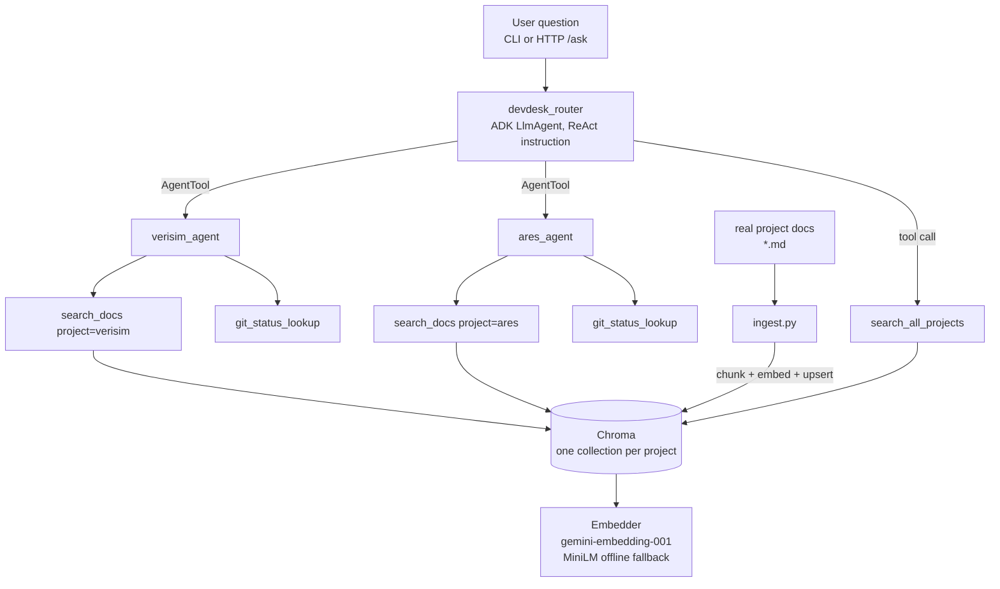

# DevDesk

A multi-agent RAG assistant built with [Google's Agent Development Kit
(ADK)](https://google.github.io/adk-docs/): a router agent delegates
questions to per-project specialist agents, each grounded in that
project's real documentation through retrieval-augmented generation.

It's built as a demonstration of the pattern an FDE (Applied AI) rebuilds
for every new customer — point the agent at a codebase/doc set (a
"tenant"), and it becomes a support agent for that project. The two
tenants used to build and evaluate it here are the author's own public
projects:

| Tenant | What it is | Source |
|---|---|---|
| `ares` | Local, Ollama-backed multi-agent stack | [Emperor-Z/ares](https://github.com/Emperor-Z/ares) (public, MIT) |
| `verisim` | Simulation-training dissertation project | [Emperor-Z/verisim](https://github.com/Emperor-Z/verisim) (public, MIT) |

A tenant is one `ProjectConfig` entry in `src/devdesk/config.py`: a
source path, a display name, and a description of what its docs cover.
The specialist agent (`specialists/factory.py`), its tools, and the
router's routing guidance and tool list are all generated from that
entry, so onboarding is one config entry plus `python -m
devdesk.rag.ingest`. The description matters: the router routes on it,
which the eval showed directly (see Evaluation).

## Architecture



**Delegation pattern**: explicit tool-based delegation, not ADK's automatic
sub-agent transfer. The router's specialists are wrapped as `AgentTool`s,
so routing is a visible, explicit tool call the router reasons about
(ReAct: identify project → call the right tool → compose the answer),
rather than an implicit handoff. This matches how a support agent actually
needs to behave in front of a customer — the decision of *which* system is
being asked about has to be auditable.

**RAG chunking**: markdown-header-aware. A section is kept whole if it fits
inside the token cap; otherwise it's hard-split with overlap. Token counts
always use the MiniLM tokenizer — even when the active embedder is
Gemini — because MiniLM has the stricter 256-token hard cutoff of the two
backends, so sizing every chunk against it keeps both safe from silent
truncation. The chunk cap is 220 tokens with 35-token overlap. Why this
matters for hallucination: a chunk boundary that lands mid-thought hands
the LLM a fragment that reads as ambiguous or contradictory, which is a
common trigger for the model to "fill in" the missing context itself.
Keeping whole subsections together for the common case (structured docs)
avoids that.

**Anti-hallucination behavior**: every specialist is instructed to call
`search_docs` before answering, cite the tool's pre-formatted `citation`
string on every claim, and say plainly when nothing relevant was found
rather than generalizing from training knowledge. `search_docs` itself
enforces a cosine-similarity floor (0.64 for Gemini embeddings, 0.35 for
MiniLM — measured, see Evaluation) — weak matches are dropped rather
than returned, so "no relevant docs" is a real, distinct outcome the agent
can report instead of stretching a bad match into an answer.

## Observability

Two ADK plugins (`google.adk.plugins.base_plugin.BasePlugin`) are wired
into every run via `InMemoryRunner(plugins=[...])` in `cli.py`, applying
uniformly to the router and every specialist without touching agent code:

- **`observability/logging.py` (`StructuredLoggingPlugin`)** — one JSON
  line per step (run/model/tool start, end, error) to stdout and
  `logs/devdesk.jsonl` (gitignored), each with `invocation_id`,
  `agent_name`, and `latency_ms`.
- **`observability/tracing.py` (`LangfuseTracingPlugin`)** — mirrors the
  same steps into a self-hosted Langfuse instance as a trace with
  span/generation children, so real trace viewing comes from existing
  infra rather than a new stack. **No-op** without
  `LANGFUSE_PUBLIC_KEY`/`LANGFUSE_SECRET_KEY` set — DevDesk works
  identically with or without Langfuse configured.

**Correlating before/after pairs**: ADK constructs a fresh
`CallbackContext` object per callback invocation, so `id(callback_context)`
does *not* identify the same model call across its `before_model_callback`
and `after_model_callback` pair (this looked right in a naive first pass —
every latency read as exactly `0.0` until caught against a live run).
Model calls within one agent's turn run strictly sequentially, so both
plugins key a LIFO stack by `invocation_id` instead.
`ToolContext.function_call_id` is a real per-call identifier and doesn't
have this problem.

## Hardening

Two more plugins, wired in alongside the observability ones:

- **`hardening/rate_limit.py` (`RateLimitPlugin`)** — proactive
  fixed-interval pacing of model calls (`RATE_LIMIT_RPM`, default 8),
  ahead of hitting a 429 rather than reacting to one.
- **`hardening/error_handling.py` (`GracefulDegradationPlugin`)** — turns
  an unhandled model or tool error into a normal, reportable result
  instead of a crash. ADK's `on_tool_error_callback`/
  `on_model_error_callback` can each return a value in place of letting
  the error propagate — that's the mechanism used here, not a new retry
  layer. Verified live by forcing `gemini-3.8-flash`'s 5 req/min free-tier
  limit: the CLI prints a clean "couldn't reach the model right now, try
  again shortly" instead of a stack trace.

Retry itself already exists (`llm_client.py`'s tenacity wrapper for
embeddings, `google-genai`'s own client for chat calls) and isn't
duplicated — `hardening/retry.py` stays an intentionally empty stub
explaining why.

## Setup

Requires Python 3.12 (3.14 has had `chromadb`/dependency compatibility
issues at time of writing — see `context.md`).

```bash
uv venv -p 3.12 .venv
source .venv/bin/activate
uv pip install -e ".[dev,offline]"   # drop `offline` if you always have GOOGLE_API_KEY

cp .env.example .env
# edit .env: set GOOGLE_API_KEY (see below)

python -m devdesk.rag.ingest        # index both tenants
python -m devdesk.cli "what agents make up the Ares stack?"
```

### API keys you need

- **`GOOGLE_API_KEY`** — a free [Google AI Studio](https://aistudio.google.com/apikey)
  key. No GCP project or billing needed to run locally; it drives both
  the chat model (`gemini-3.5-flash-lite` by default — chosen on free-tier
  limits, see Evaluation) and the primary embedding model
  (`gemini-embedding-001`). Without it, embeddings fall back to a local
  MiniLM model if the `offline` extra is installed (chat still needs a
  key).
- **`LANGFUSE_PUBLIC_KEY` / `LANGFUSE_SECRET_KEY`** — optional. Create a
  "DevDesk" project in a self-hosted Langfuse instance (Settings → API
  Keys) if you want real trace viewing; leave unset and tracing is a
  no-op.

Without a key set, `pytest` still passes in full (all unit tests use a
fake embedder / stub, no network calls); only the one `@pytest.mark.integration`
test is skipped.

## Deployment

`src/devdesk/server.py` serves the same runner over HTTP (`POST /ask`,
`GET /healthz`) for containers:

```bash
python -m devdesk.rag.ingest     # the index is baked into the image
docker compose up --build
curl -s localhost:8080/ask -H 'content-type: application/json' \
     -d '{"question": "What slash commands does the Ares REPL support?"}'
```

The image is python:3.12-slim with no torch (the MiniLM fallback is the
optional `offline` extra), runs as a non-root user, and excludes `.env` —
the key arrives at runtime. The server refuses to start without
`GOOGLE_API_KEY`, since the baked index is Gemini-embedded and a MiniLM
query against it would fail on the first request instead.

Cloud Run config is in `deploy/` — `cloudrun_service.yaml` plus a
step-by-step runbook in `deploy/iam_setup.md`. The shape is
least-privilege:

- a dedicated runtime service account with **no project roles**, only
  `secretAccessor` on the one Secret Manager secret holding the Gemini key;
- **no `allUsers` invoker** — Cloud Run IAM is the auth boundary, callers
  need `roles/run.invoker` on the service and an identity token;
- **`maxScale: 1`**, because `RateLimitPlugin` paces per process while
  the free-tier quota is per project;
- scale-to-zero, so idle cost stays at zero.

Verified locally: the container image builds, answers a real question
end to end (routed to `ares_agent`, fully cited, ~25s), rejects invalid
input with 422, and refuses to start without a key. Not yet deployed to
a live GCP project — that needs billing enabled.

## Status

All seven build phases are done — scaffold, agents/tools/RAG,
observability, hardening, eval harness, deployment config, and this
README. See `context.md` for the full build log. Open items: the
failures in the e2e eval (above), and a live Cloud Run deploy.

## Evaluation

```bash
python eval/run_eval.py --mode retrieval   # 1 embedding call/query, no chat model
python eval/run_eval.py --mode e2e         # full router -> specialist loop
python eval/run_eval.py --mode e2e --ids ares-memory none-sourdough --fail-under 1.0
```

16 hand-written queries (`eval/queries.yaml`): 7 VeriSim, 6 Ares, 1
cross-project, 2 out-of-scope. Scoring is deterministic — no LLM judge:

- **retrieval**: hit@k, hit@1, MRR against the expected source files, and
  whether out-of-scope queries are rejected by the similarity cutoff.
- **e2e**: routing accuracy (right specialist, no detour), citation of an
  expected source, required keywords, abstention on out-of-scope queries,
  latency. Answers replaced by the graceful-degradation fallback (free-tier
  503s) are counted as `degraded` and excluded from quality rates.

Latest retrieval run (gemini-embedding-001): hit@k **1.0**, hit@1 **0.79**,
MRR **0.89**, out-of-scope rejected **2/2**. The first run caught a real
bug: the 0.35 similarity cutoff (tuned for MiniLM) let everything through
under Gemini embeddings, whose similarity floor is ~0.5 — a sourdough
question scored 0.51 against the VeriSim docs. Measured relevant hits
bottom out at 0.661 and out-of-scope at 0.621, so the Gemini cutoff is now
0.64, chosen per backend in `config.min_query_similarity()`.

Latest e2e run (gemini-3.5-flash-lite, `eval/results/20260926T185617Z_e2e.json`):

| metric | score |
|---|---|
| pass rate | **12/16 (0.75)** |
| routing accuracy | 0.86 |
| citation accuracy | 1.00 |
| keyword recall | 0.86 |
| out-of-scope abstention | 2/2 |
| degraded (quota/503) | 0 |
| latency p50 / max | 31s / 47s (mostly deliberate rate-limit pacing) |

The four failures, read by hand:

- `verisim-fly-scaling` — genuine routing miss: tried `ares_agent` first
  for a Convex/Fly.io question, recovered via cross-project search.
- `verisim-finding-3` — the question never names a project, so the router
  used `search_all_projects` (its own rule for ambiguous questions). Answer
  correct and cited; left as a failure rather than loosening the
  expectation after seeing results.
- `verisim-engine-step` — correct flow described, but never names the
  `runStep` entrypoint.
- `ares-next-steps` — answered from the plan's Summary/Assumptions instead
  of its "Status > Next" list, which retrieval had ranked 2nd.

Model choice came from this too: gemini-2.5-flash's free tier on this key
is **20 requests/day** — about 4 questions at 5+ model calls each — and the
first e2e attempt on it came back 4/4 degraded (429 `RESOURCE_EXHAUSTED`,
`GenerateRequestsPerDayPerProjectPerModel-FreeTier`). The default is now
gemini-3.5-flash-lite, which ran all 16 without a quota error.

## Repo layout

```
src/devdesk/
  router_agent.py        # top-level LlmAgent, explicit delegation
  specialists/factory.py  # builds each tenant's specialist from config
  tools/                  # search_docs, search_all_projects, git_status_lookup
  rag/                     # chunking, embeddings, vectorstore, ingest
  observability/          # structured logging + Langfuse plugins
  hardening/              # rate limiting + graceful degradation plugins
  evaluation/             # eval scoring (pure) + runner
  cli.py                  # python -m devdesk.cli "question"
  server.py               # FastAPI: POST /ask, GET /healthz
eval/queries.yaml          # hand-written eval set
eval/run_eval.py           # python eval/run_eval.py --mode retrieval|e2e
eval/results/              # committed baseline runs
deploy/                    # Cloud Run service spec + IAM runbook
Dockerfile, docker-compose.yml
tests/                      # pytest, no network calls in the default run
```
